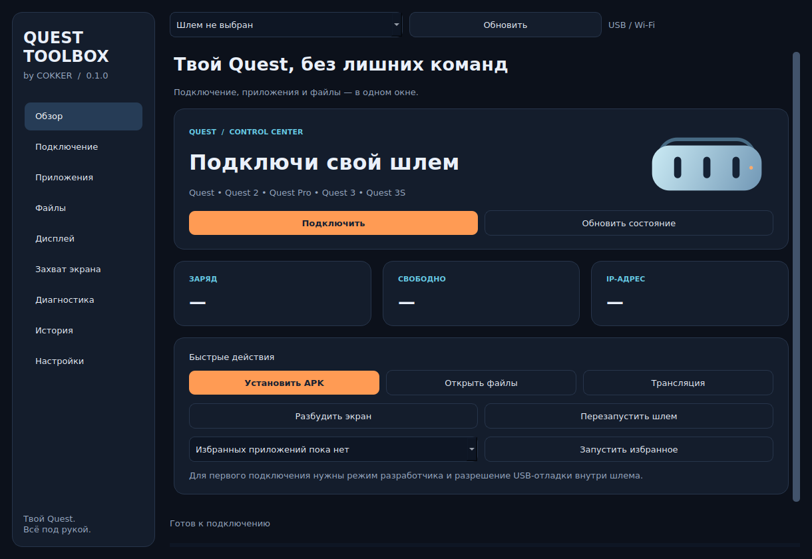

# Quest Toolbox

A desktop control center for Meta Quest, built by COKKER. Русский / English.

**0.1.0 Preview — Windows 10/11 x64.** Неофициальный проект, не связан с Meta.



## Быстрый запуск

1. Распакуйте **весь** архив `QuestToolbox-0.1.0-Windows-x64.zip` в отдельную папку.
2. Запустите `QuestToolbox.exe`. Все вложенные папки должны оставаться рядом с EXE; в сборке GitHub это папка `_internal`.
3. Откройте **Настройки** → **Скачать официальный ADB**, ознакомьтесь с условиями Android SDK и подтвердите загрузку. Можно выбрать существующий `adb.exe`, например из `C:\adb\platform-tools`.
4. Включите режим разработчика для Quest, подключите USB-кабель с передачей данных и разрешите USB-отладку внутри шлема.
5. Нажмите **Обновить** и выберите шлем сверху. Откройте **Обзор → Обновить состояние**.

Python устанавливать не нужно. Программа не требует запуска от администратора. Установка USB-драйвера, если он нужен Windows, может требовать прав администратора. ADB и scrcpy скачиваются отдельно с официальных источников; можно выбрать уже установленную копию.

## Возможности

- Несколько устройств; отдельное имя для каждого; состояния unauthorized/offline.
- USB и Wi-Fi ADB, запоминание адреса, включение через USB и отдельное выключение Wi-Fi ADB на шлеме.
- Модель, Android, версия сборки, батарея, температура батареи, свободное место, IP.
- Установка APK перетаскиванием, пакетная последовательная установка и `install-multiple` для split APK.
- Избранные приложения на главной; список и поиск пакетов, запуск Activity, принудительная остановка, сведения, экспорт всех APK пакета, удаление сторонних приложений.
- Файлы внутри `/sdcard`: просмотр, отправка очередью, скачивание, создание и удаление папок; ярлыки к фото и видео Quest.
- Документированные частоты дисплея, размеры текстуры, динамическая фовеация; профили по модели.
- Чтение значений обратно после изменения, транзакционный откат при ошибке и возврат к первоначальным значениям сеанса.
- Параметры штатной записи: размеры, битрейт и полная частота захвата.
- Трансляция и запись MP4 на ПК через официальный scrcpy; PNG через `screencap`.
- Живой logcat: уровень, текстовый фильтр, сохранение видимых строк.
- Диагностический отчёт с редактируемым предпросмотром и частичным скрытием чувствительных данных.
- История последних 300 операций, тёмная/светлая тема, RU/EN, проверка релизов выбранного GitHub-репозитория.
- ADB запускается без оболочки Windows и с явным серийным номером. Долгие операции работают вне GUI-потока, имеют тайм-аут и кнопку отмены.

## Совместимость — честные границы

| Модель | Частоты из документации Meta | Общие ADB-функции | Проверка физического устройства |
|---|---|---|---|
| Quest | 60, 72 Гц | Реализованы | Не проводилась |
| Quest 2 | 60, 72, 80, 90, 120 Гц | Реализованы | Не проводилась |
| Quest Pro | 72, 80, 90 Гц | Реализованы | Не проводилась |
| Quest 3 | 72, 80, 90, 120 Гц | Реализованы | Не проводилась |
| Quest 3S | 72, 80, 90, 120 Гц | Реализованы | Не проводилась |
| Неизвестная модель | Изменение параметров отключено | Доступны при поддержке Android/ADB | Не проводилась |

Частоты сверены с документацией Meta 1 октября 2026. Это список разрешённых значений, **не аппаратный тест на всех прошивках**. Сохранение `getprop` не доказывает изменение реального FPS. Приложение и прошивка могут игнорировать или переопределять параметры. Временные свойства сбрасываются при перезагрузке. Настройки текстур автономных приложений не меняют разрешение PCVR / Steam Link.

## Ограничения Preview

- GitHub Releases собирается на Windows через PyInstaller. Перед публикацией запускается сам собранный EXE и проверяется отрисовка всех девяти разделов. Проверка физических Quest остаётся отдельным этапом; шлемы недоступны CI.
- Автоматические тесты проверяют ADB-логику, валидацию, откат, процессные тайм-ауты, каналы обновлений и интерфейс Qt. Есть регрессии для прокрутки колесом и сохранения позиции страницы.
- Пакет portable содержит EXE и зависимые папки, это не одиночный самодостаточный файл. GitHub Actions собирает PyInstaller-вариант и отдельно проверяет его запуск.
- Сторонние программы ADB используют общий локальный сервер. Его перезапуск требует подтверждения и может прервать их соединения.
- При отмене передачи уже скопированные данные остаются. Частично переданный файл нужно проверить или передать заново. Несколько отдельных APK не образуют общую транзакцию; завершённые установки остаются.
- Данные защищённых приложений и сохранения игр не резервируются. Экспорт APK включает base/split APK, но не приватные данные.
- `Android/data`, захват картинки, звук и некоторые свойства могут быть запрещены прошивкой. Ошибки выводятся, обходы ограничений не выполняются.
- scrcpy запускается без управления. Он не заменяет PCVR и не обеспечивает VR-контроллеры или доступ к защищённому passthrough. Для корректного завершения MP4 закройте окно scrcpy.
- Проверка обновлений показывает официальный GitHub-релиз и открывает страницу загрузки. Автоматического запуска скачанного EXE нет. Канал Preview включён по умолчанию; его можно отключить в настройках.
- Язык интерфейса меняется после перезапуска. Некоторые подробные диагностические сообщения ядра пока на русском.
- Нет root-эксплойтов, отключения защиты, изменения прошивки, принудительного разгона Pro до 120 Гц и неподтверждённых «ускорителей» CPU/GPU.

## Данные и приватность

Настройки, профили, псевдонимы и история сохраняются в `%LOCALAPPDATA%\QuestToolbox`. Там же лежат скачанные инструменты. На других ОС — `~/.local/share/QuestToolbox`.

Телеметрии нет. Сеть используется только для запрошенных загрузок и проверки релизов. История содержит время, название операции и результат, без полного вывода ADB. Отчёты и логи сохраняются только по запросу. Автоматическая редакция не гарантирует удаление всех личных данных: перед отправкой проверьте текст.

## Разработка

```powershell
py -3.12 -m venv .venv
.\.venv\Scripts\python.exe -m pip install -r requirements.txt pytest pyinstaller
.\.venv\Scripts\python.exe main.py
.\.venv\Scripts\python.exe -m pytest -q
```

Готовая сборка Windows: запустите `build-windows.cmd`. Результат — `dist\QuestToolbox\QuestToolbox.exe` и ZIP рядом. Для запуска исходников на Linux поддержка USB-драйверов и локальная установка scrcpy настраиваются отдельно.

GitHub Actions запускает тесты и создаёт Windows-артефакт на push и вручную. Push тега `v0.1.0` или ручной запуск с флагом `publish` создаёт GitHub Release только после успешных проверок и запуска собранного EXE. Проверяйте Windows-сборку и устройство перед переводом Preview в стабильный релиз.

## Источники

- [Android Debug Bridge](https://developer.android.com/tools/adb)
- [Meta: подключение устройства](https://developers.meta.com/horizon/documentation/native/android/mobile-device-setup/)
- [Meta: системные свойства](https://developers.meta.com/horizon/documentation/native/android/ts-systemproperties/)
- [Официальный scrcpy](https://github.com/Genymobile/scrcpy)
- [Условия Android SDK](https://developer.android.com/studio/terms)

## Лицензии

Код Quest Toolbox — MIT. CPython, Qt/PySide6 и Shiboken имеют собственные лицензии, см. `THIRD_PARTY_NOTICES.md` и `licenses`. ADB и scrcpy не включены в архив. Исходники приложения включены; библиотеки Qt поставляются отдельными DLL и могут быть заменены совместимой сборкой.
